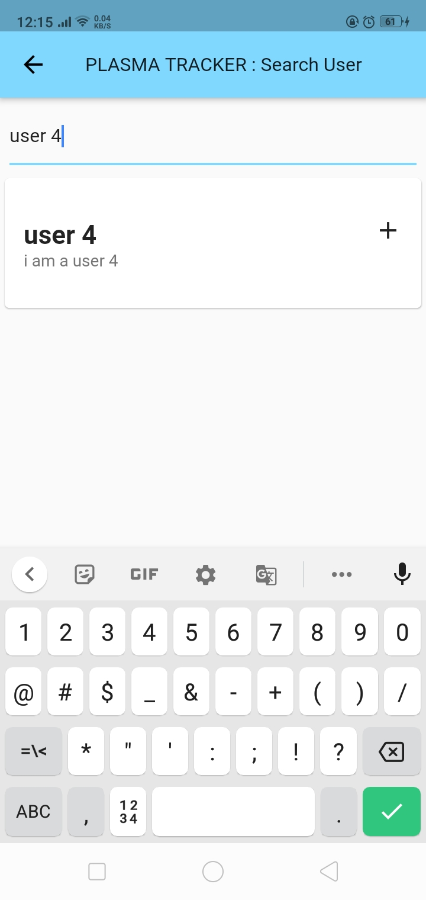

## Problem Statement:

Before there was a Plasma Tracker, it was difficult to track plasma donors from different regions. Patients in serious condition who need plasma for their therapy will not lose their life because of any lateness or unable to find any donor. Although there are plasma banks in the hospitals, Searching for plasma becomes a problem because of its high demand. Sometimes it becomes difficult to get plasma .Many patients could lose their life if not provided on time. As a result of this problem, a new app is developed – Plasma Tracker.

## Description:

Plasma Tracker is an app that keeps the track of recovered covid positive patients. They will also be able to track discharged patients who have the potential to become plasma donors 28 days after they recover. The app will act as a bridge between patients seeking plasma therapy and donors who have recovered and have completed 28 days post recovery. People with the blood type AB are in the greatest demand for plasma donation .They make up just 2 in 50 people, their plasma is universal. This means their plasma can be used by anyone. Nowadays , plasma therapy is a very crucial requirement to save people's lives. The concept of this app is purely to establish a connection between plasma seeker and potential plasma donor.

## The app has following features:

-   User Authentication​
-   Need help? section​
-   Donation request section
-   Donation history​
-   Profile section​

## User Authentication:

Anyone can create their account on our app by using a valid email id.
Then we will send a confirmation email with OTP.
If the user enters the correct OTP. The account will become verified. Else the user will have to verify the account later to use the app.
Only verified users will be allowed to use the app.
The app will take care of confidentiality of user’s information.

## Need Help? Section

If a User needs plasma for himself or some family member. He/she will search for the available donors based on blood group and city.
Then he will see the list of all such donors.
He can send a request for donation to any of the donors displayed in that list.
We will then send an email notification to that donor.
If the donor accepts a request. Then all other requests sent will get deleted. And also all the requests received by that donor will get deleted.
After a request gets accepted. The needy person will also get notified about it. And users of both ends will get the contact details of each other to carry out the donation process for real.
After successful donation (request sent and accepted). The detail of this donation will get automatically added in the donation history of the donor

## Donation Request Section

The user who is available as a donor will receive donation requests from the persons in need.
This section will contain the list of all such requests.
The donor can accept or decline a request as per his/her choice.

## Donation history

A table like section which will contain a list of all previous successful plasma donation of the user.
User can delete an entry from the table.

## Profile Section

This section will contain the general and health related information of the user and the user can edit this information.

## Flow diagram

